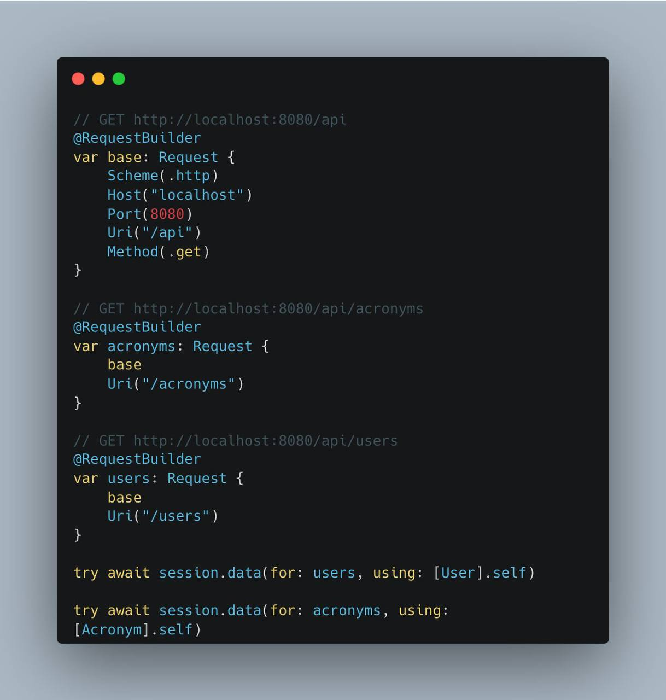

<p align="center">
  <a href="https://github.com/agescura/swift-urlrequest-builder">
    
  </a>
  <a href="https://github.com/agescura/swift-urlrequest-builder">
    
  </a>
  <a href="https://github.com/agescura/swift-urlrequest-builder">
    
  </a>
  <a href="https://github.com/agescura/swift-urlrequest-builder/blob/master/LICENSE">
    
  </a>
</p>

# Swift Request

A library extending a URLRequest instance in a ergonomic, scalable, composable and testable manner.

## Motivation

Using Foundation framework we have the URLSession class, successor to NSURLSession, which is responsible for making requests in the Internet layer.

We have two ways to make calls, a simple one by passing a URL and another, more complex, with URLRequest.

```swift
    try await URLSession
        .shared
        .data(
            from: URL(
                string: "https://api.github.com/users/agescura/repos"
            )!
        )
```


```swift
    var request = URLRequest(
        url: url,
        cachePolicy: .returnCacheDataDontLoad
    )
    request.httpMethod = "GET"
    request.httpBody = nil
    try await URLSession.shared.data(for: request)
```

In small applications that do not make many calls, it does not make much sense to ergonomicize the system. But, as we have to manage many calls, the complexity of the system will appear.

### Builders



### Demo

Check the demostration in the Demo/App folder.

* Run the server scheme. First, you need to setup a docker image like this.

```
docker run --name postgres -e POSTGRES_DB=vapor_database \
  -e POSTGRES_USER=vapor_username \
  -e POSTGRES_PASSWORD=vapor_password \
  -p 5432:5432 -d postgres
```

* Then, run the App scheme. App client is developed using The Composable Architecture. If you want to see how to use this library, check the ApiClient package.

### Credits

* The Composable Architecture, by Pointfree.
* Server-Side Swift with Vapor, by Tim Condon (Kodeco editor)